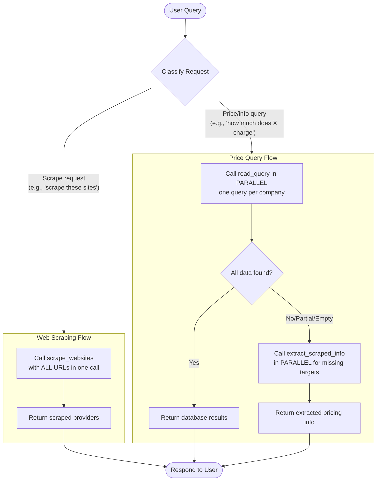

# LLM Inference Pricing Analyzer

A Model Context Protocol (MCP) based chatbot that scrapes LLM inference pricing websites to research and compare costs across different providers.

---

## Overview

This project provides tools to scrape, store, and query pricing information from LLM inference providers using the MCP architecture.

### MCP Server (`starter_server.py`)

The server exposes tools for web scraping and data extraction:

| Tool | Description |
|------|-------------|
| `scrape_websites` | Scrapes multiple LLM pricing websites using Firecrawl API and caches content locally |
| `extract_scraped_info` | Retrieves cached scraped content by provider name, URL, or domain |

**Features:**
- Automatic caching with 3-hour TTL to avoid redundant API calls
- Saves content in both markdown and HTML formats
- Metadata tracking with timestamps and scrape status

### MCP Client (`starter_client.py`)

An interactive chatbot that orchestrates multiple MCP servers:

| Component | Description |
|-----------|-------------|
| **Multi-server support** | Connects to scraping, SQLite, and filesystem MCP servers |
| **Smart querying** | Checks database first, falls back to cached scrapes |
| **Data extraction** | Automatically extracts and stores pricing data using Claude |
| **Parallel execution** | Executes multiple tool calls concurrently for efficiency |

---

## Architecture Flow



---

## Quick Start

### 1. Setup Environment

```bash
# Create and activate virtual environment
uv venv
uv sync
```

### 2. Configure API Keys

Create a `.env` file:

```env
ANTHROPIC_API_KEY=your_anthropic_key
FIRECRAWL_API_KEY=your_firecrawl_key
```

### 3. Run the Server (Development)

```bash
uv run mcp dev starter_server.py
```

### 4. Run the Client

```bash
uv run python starter_client.py
```

---

## Example Usage

The tool supports scraping **any website** with pricing data. Below is an example workflow:

### Step 1: Scrape the sites

```
scrape these sites: {'cloudrift': 'https://www.cloudrift.ai/inference', 'deepinfra': 'https://deepinfra.com/pricing', 'fireworks': 'https://fireworks.ai/pricing#serverless-pricing', 'groq': 'https://groq.com/pricing'}
```

### Step 2: Ask questions about the scraped content

```
How much does cloudrift ai (https://www.cloudrift.ai/inference) charge for deepseek v3?
```

```
How much does deepinfra (https://deepinfra.com/pricing) charge for deepseek v3
```

```
Compare cloudrift ai and deepinfra's costs for deepseek v3
```

### Step 3: Check your database

Type `show data` to see the structured data your DataExtractor saved to the SQLite database.

---

## Available Tools

The client connects to 3 MCP servers providing these tools:

| Category | Tools |
|----------|-------|
| **Scraping** | `scrape_websites`, `extract_scraped_info` |
| **Database** | `read_query`, `write_query`, `create_table`, `list_tables`, `describe_table` |
| **Filesystem** | `read_file`, `write_file`, `edit_file`, `list_directory`, `search_files` |

---

## Database Schema

```sql
CREATE TABLE pricing_plans (
    id INTEGER PRIMARY KEY,
    company_name TEXT NOT NULL,
    plan_name TEXT NOT NULL,
    input_tokens REAL,        -- Price per million input tokens
    output_tokens REAL,       -- Price per million output tokens
    currency TEXT DEFAULT 'USD',
    billing_period TEXT,
    features TEXT,            -- JSON array
    limitations TEXT,
    source_query TEXT,
    created_at DATETIME,
    UNIQUE(company_name, plan_name)
);
```

---

## Resources

- [MCP Documentation](https://platform.claude.com/docs/en/intro)
- [Firecrawl API](https://firecrawl.dev/)
